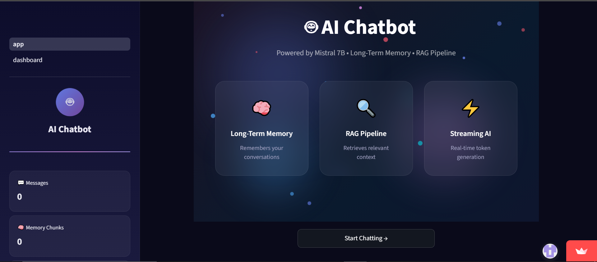

# 🤖 LLM-Powered AI Chatbot with Long-Term Memory

<div align="center">


**A locally-hosted AI chatbot with long-term memory, RAG pipeline, 
streaming output, and MLflow observability — built for production.**

[Features](#-features) • [Quick Start](#-quick-start) • [Architecture](#️-architecture) • [Dashboard](#-mlflow-dashboard) • [Docker](#-docker) • [Tests](#-tests)

</div>

---

## 📸 Preview



---

## ✨ Features

| Feature | Description |
|---------|-------------|
| 🧠 **Long-Term Memory** | ChromaDB vector store persists conversation history across sessions |
| 🔍 **RAG Pipeline** | Retrieves top-3 semantically similar past chunks with cosine distance filtering (< 0.4) |
| 🌊 **Streaming Output** | Token-by-token response streaming for low perceived latency |
| 📊 **MLflow Dashboard** | Tracks latency, relevance scores, chunk retrieval, and response metrics per query |
| 🔄 **Multi-Backend LLM** | Switch between Local Mistral 7B, HuggingFace API, OpenAI, Deepseek via one config line |
| 🎨 **Animated UI** | Gradient landing screen with floating particles, glassmorphism chat bubbles |
| 🐳 **Docker Ready** | Full containerization with model volume mounting |
| ✅ **Tested** | pytest suite with mocked dependencies for memory, retriever, and LLM |

---

## 🏗️ Architecture

```
User Input (Streamlit UI)
        ↓
ChatbotPipeline (main.py)
        ↓
   ┌────┴──────┐
   ↓           ↓
Memory      Retriever
(memory.py) (retriever.py)
   ↓           ↓
   Embedder ← sentence-transformers
              (all-MiniLM-L6-v2, 384-dim)
        ↓
   ChromaDB (cosine)
        ↓
   LLM Backend
   ┌──────────┬──────────┬──────────┐
   ↓          ↓          ↓          ↓
LocalLLM   HuggingFace  OpenAI   Deepseek
(Mistral   (Inference   (GPT     (deepseek
7B GGUF)   API)        3.5)      -chat)
        ↓
   MLflow Observer
   (observability.py)
        ↓
📊 Dashboard (pages/dashboard.py)
```

---

## 📁 Project Structure

```
llm-chatbot-memory/
├── app.py                       # Streamlit UI — landing screen + animated chat
├── main.py                      # ChatbotPipeline — RAG orchestrator
├── requirements.txt             # Pinned dependencies
├── .env.example                 # Environment variable template
├── configs/
│   └── model_config.yaml        # All runtime config (LLM, memory, ChromaDB)
├── core/
│   ├── llm.py                   # LLM abstraction (Local/HuggingFace/OpenAI/Deepseek)
│   ├── embeddings.py            # Sentence transformer embedder
│   ├── retriever.py             # ChromaDB vector search + distance filtering
│   ├── memory.py                # Conversation memory + RAG context + summarization
│   ├── observability.py         # MLflow query logging
│   └── utils.py                 # Config loader + logging setup
├── pages/
│   └── dashboard.py             # MLflow observability dashboard
├── tests/
│   ├── test_memory.py           # Memory unit tests (mocked retriever)
│   ├── test_retriever.py        # Retriever tests (mocked ChromaDB)
│   └── test_llm.py              # LLM tests (mocked backends)
├── deployment/
│   └── Dockerfile               # Production container
├── models/                      # Local .gguf files — gitignored (4GB+)
└── vectorstore/chroma_db/       # Persistent ChromaDB — gitignored
```

---

## 🚀 Quick Start

### Prerequisites
- Python 3.10+
- Git

---

### Option A — HuggingFace API *(recommended — no download needed)*

```bash
# 1. Clone
git clone https://github.com/MuhammadHamzaSajjad274/LLM-Powered-AI-Chatbot-with-Memory.git
cd LLM-Powered-AI-Chatbot-with-Memory

# 2. Create virtual environment
python -m venv venv
venv\Scripts\activate        # Windows
# source venv/bin/activate   # Mac/Linux

# 3. Install dependencies
pip install -r requirements.txt

# 4. Set your HuggingFace token
cp .env.example .env
# Edit .env and add: HF_API_TOKEN=your-token-here
# Get free token at: https://huggingface.co/settings/tokens

# 5. Set backend in configs/model_config.yaml
#    llm:
#      type: "huggingface"

# 6. Run
streamlit run app.py
```

---

### Option B — Local Mistral 7B *(fully private, no API needed)*

```bash
# 1-3. Same as above

# 4. Download model (4GB)
# https://huggingface.co/TheBloke/Mistral-7B-Instruct-v0.2-GGUF
# Place in: models/mistral-7b-instruct-v0.2.Q4_K_M.gguf

# 5. Set backend in configs/model_config.yaml
#    llm:
#      type: "local"

# 6. Run
streamlit run app.py
```

---

### Option C — OpenAI / Deepseek

Add `OPENAI_API_KEY` or `DEEPSEEK_API_KEY` to `.env` and set 
`llm.type: "openai"` or `llm.type: "deepseek"` in the config.

---

## 📊 MLflow Dashboard

Click **"dashboard"** in the Streamlit sidebar to open the 
observability dashboard showing:

- Total queries processed
- Average response latency (ms)
- Chunk retrieval rate and relevance scores
- Response length trends over time

Optional — launch the native MLflow UI:

```bash
mlflow ui --backend-store-uri ./mlflow_runs
# Open http://localhost:5000
```

---

## 🐳 Docker

```bash
# Build
docker build -t llm-chatbot .

# Run with local model mounted
docker run -v /path/to/your/models:/app/models \
           -e HF_API_TOKEN=your-token \
           -p 8501:8501 \
           llm-chatbot

# Open http://localhost:8501
```

---

## 🧪 Tests

```bash
pytest tests/ -v
```

Tests cover:
- Memory chunk storage (only last exchange stored)
- RAG context retrieval with distance filtering
- LLM error handling (missing token, missing model file)
- All dependencies mocked — no real model or DB required

---

## 🛠️ Tech Stack

| Layer | Technology | Purpose |
|-------|-----------|---------|
| UI | Streamlit + CSS | Animated chat interface |
| LLM Local | Mistral 7B Q4 via llama-cpp-python | Private, offline inference |
| LLM Cloud | HuggingFace Inference API | Free cloud inference |
| LLM Cloud | OpenAI GPT-3.5-turbo | Commercial cloud inference |
| Embeddings | sentence-transformers/all-MiniLM-L6-v2 | 384-dim semantic vectors |
| Vector Store | ChromaDB | Persistent cosine similarity search |
| Observability | MLflow | Query metrics and latency tracking |
| Testing | pytest + unittest.mock | Isolated unit tests |
| Deployment | Docker | Containerized production deployment |

---

## 📈 CV Highlights

- Built end-to-end RAG pipeline with cosine similarity filtering (distance < 0.4) over persistent ChromaDB conversation history
- Implemented streaming token output (llama-cpp-python + HuggingFace Inference API) reducing perceived response latency significantly
- Added MLflow observability layer tracking latency, relevance scores, chunk retrieval rate, and response metrics per query turn
- Designed modular LLM abstraction (LLMBase) supporting 4 backends switchable via single config line — zero code changes required
- Unit tested memory, retriever, and LLM components with pytest using unittest.mock — no real model or database required for CI

---

## 🤝 Contributing

Pull requests welcome. For major changes please open an issue first.

---

## 📝 License

MIT License — see [LICENSE](LICENSE) for details.

---

<div align="center">

Built with ❤️ using Python, Streamlit, and open-source AI

</div>
