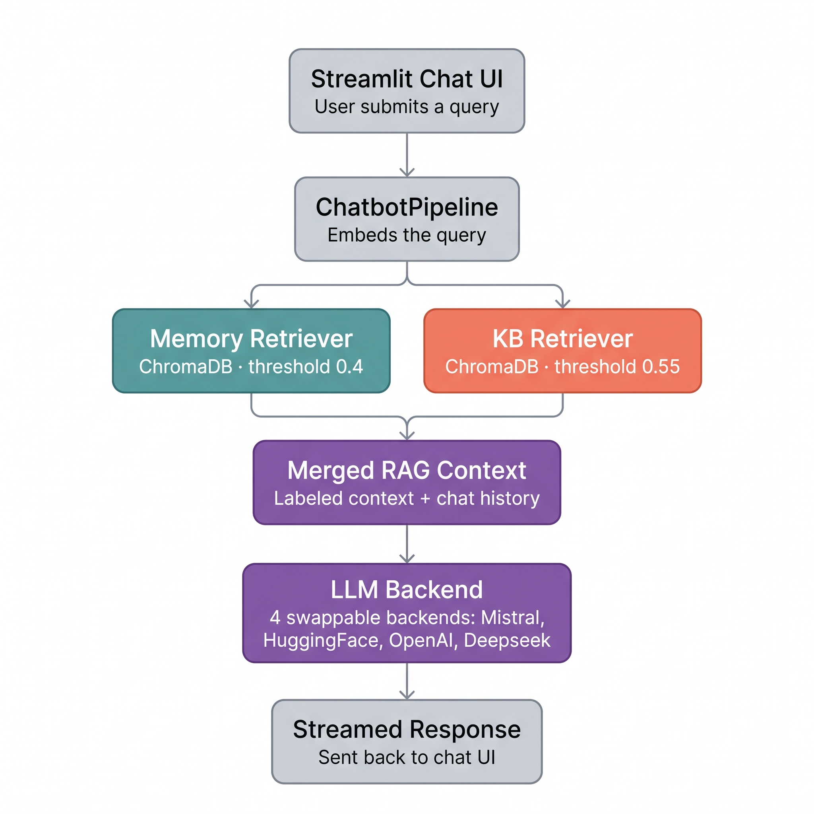

# 🤖 LLM-Powered AI Chatbot with Long-Term Memory

<div align="center">


**A Streamlit RAG chatbot with persistent long-term memory, a dual-source retrieval pipeline, streaming responses, and MLflow observability.**

[Overview](#-overview) • [Features](#-features) • [Architecture](#️-architecture) • [Quick Start](#-quick-start) • [Dashboard](#-mlflow-dashboard) • [Docker](#-docker) • [Tests](#-tests) • [Tech Stack](#️-tech-stack)

</div>

---

## 📖 Overview

Most chatbots are stateless — close the tab and every prior exchange is gone. Generic bots also lack any real knowledge of your product or domain unless you paste in context by hand, every time.

This project solves both problems with **dual retrieval-augmented generation (RAG)**: one vector store holds long-term conversational memory, and a second holds a static product knowledge base. Every query is checked against both, merged into a single labeled context, and passed to a configurable LLM backend that streams its response back token by token.

---

## ✨ Features

| Feature | Description |
|---|---|
| 🧠 **Long-Term Memory** | ChromaDB vector store persists conversation history across sessions |
| 🔍 **Dual RAG Pipeline** | Retrieves top-3 chunks from two independent ChromaDB collections — conversational memory (cosine distance < 0.4) and a static knowledge base (< 0.55) |
| 🌊 **Streaming Output** | Token-by-token response streaming for low perceived latency |
| 📊 **MLflow Dashboard** | Tracks latency, relevance scores, chunk retrieval, and response metrics per query |
| 🔄 **Multi-Backend LLM** | Switch between local Mistral 7B, HuggingFace, OpenAI, or Deepseek via a single config line |
| 📚 **Self-Healing KB Ingestion** | Automatically rebuilds the knowledge base from source docs on startup if the collection is empty |
| 🎨 **Animated UI** | Gradient landing screen with floating particles and glassmorphism chat bubbles |
| 🐳 **Docker Ready** | Full containerization with model volume mounting |
| ✅ **Tested** | pytest suite with mocked dependencies for memory, retriever, and LLM components |

---

## 📸 Preview


---

## 🏗️ Architecture



A user query is embedded and checked against two independent ChromaDB collections in parallel — one holding conversation history, the other holding static knowledge-base documents — each with its own similarity threshold. The results are merged into a single labeled RAG context, passed to the configured LLM backend, and streamed back to the UI. The exchange is then stored back into the memory collection, and query metrics are logged to MLflow.

<details>
<summary>Text-only version</summary>

```
User (Browser)
    ↓
Streamlit UI (app.py)
    ↓
ChatbotPipeline (main.py)
    ↓
Embedder (all-MiniLM-L6-v2)
    ↓                              ↓
Memory Retriever              KB Retriever
ChromaDB · threshold 0.4      ChromaDB · threshold 0.55
    └──────────┬───────────────────┘
               ↓
     Merged RAG context (labeled) + chat history
               ↓
     LLM Backend → Local Mistral / HuggingFace / OpenAI / Deepseek
               ↓
     Streamed response → UI
               ↓
     Stored to memory ChromaDB + logged to MLflow
```

</details>

---

## 📁 Project Structure

```
llm-chatbot-memory/
├── app.py                       # Streamlit UI — landing screen + animated chat
├── main.py                      # ChatbotPipeline — RAG orchestrator
├── requirements.txt             # Dependencies
├── .env.example                 # Environment variable template
├── configs/
│   └── model_config.yaml        # All runtime config (LLM, memory, ChromaDB)
├── core/
│   ├── llm.py                   # LLM abstraction (Local/HuggingFace/OpenAI/Deepseek)
│   ├── embeddings.py            # Sentence transformer embedder
│   ├── retriever.py             # Memory ChromaDB search + distance filtering
│   ├── kb_retriever.py          # Knowledge-base ChromaDB search + chunking
│   ├── memory.py                # Conversation memory + RAG context + summarization
│   ├── observability.py         # MLflow query logging
│   └── utils.py                 # Config loader + logging setup
├── data/kb/                     # Source markdown docs for the knowledge base
├── pages/
│   └── dashboard.py             # MLflow observability dashboard
├── tests/
│   ├── test_memory.py           # Memory unit tests (mocked retriever)
│   ├── test_retriever.py        # Retriever tests (mocked ChromaDB)
│   ├── test_llm.py              # LLM tests (mocked backends)
│   └── test_embeddings.py       # Embedder shape/consistency tests
├── deployment/
│   └── Dockerfile               # Production container
├── models/                      # Local .gguf files — gitignored (4GB+)
└── vectorstore/                 # Persistent ChromaDB collections — gitignored
```

---

## 🚀 Quick Start

### Prerequisites
- Python 3.10+
- Git

### Option A — HuggingFace API *(recommended — no download needed)*

```bash
# 1. Clone
git clone https://github.com/MuhammadHamzaSajjad274/LLM-Powered-AI-Chatbot-with-Memory.git
cd LLM-Powered-AI-Chatbot-with-Memory

# 2. Create virtual environment
python -m venv venv
venv\Scripts\activate        # Windows
# source venv/bin/activate   # Mac/Linux

# 3. Install dependencies
pip install -r requirements.txt

# 4. Set your HuggingFace token
cp .env.example .env
# Edit .env and add: HF_API_TOKEN=your-token-here
# Get a free token at: https://huggingface.co/settings/tokens

# 5. Set the backend in configs/model_config.yaml
#    llm:
#      type: "huggingface"

# 6. Run
streamlit run app.py
```

### Option B — Local Mistral 7B *(fully private, no API needed)*

```bash
# 1-3. Same as above

# 4. Download the model (4GB)
# https://huggingface.co/TheBloke/Mistral-7B-Instruct-v0.2-GGUF
# Place it at: models/mistral-7b-instruct-v0.2.Q4_K_M.gguf

# 5. Set the backend in configs/model_config.yaml
#    llm:
#      type: "local"

# 6. Run
streamlit run app.py
```

### Option C — OpenAI / Deepseek

Add `OPENAI_API_KEY` or `DEEPSEEK_API_KEY` to `.env`, then set `llm.type: "openai"` or `llm.type: "deepseek"` in `configs/model_config.yaml`.

---

## 📊 MLflow Dashboard

Click **"dashboard"** in the Streamlit sidebar to open the observability dashboard, showing:

- Total queries processed
- Average response latency (ms)
- Chunk retrieval rate and relevance scores
- Response length trends over time

Optional — launch the native MLflow UI:

```bash
mlflow ui --backend-store-uri ./mlflow_runs
# Open http://localhost:5000
```

---

## 🐳 Docker

```bash
# Build (Dockerfile lives in deployment/)
docker build -f deployment/Dockerfile -t llm-chatbot .

# Run with a local model mounted
docker run -v /path/to/your/models:/app/models \
           -e HF_API_TOKEN=your-token \
           -p 8501:8501 \
           llm-chatbot

# Open http://localhost:8501
```

---

## 🧪 Tests

```bash
pytest tests/ -v
```

Tests cover:
- Memory chunk storage (only the last exchange is stored)
- RAG context retrieval with distance filtering
- LLM error handling (missing token, missing model file)
- All dependencies mocked — no real model or database required

---

## 🛠️ Tech Stack

| Layer | Technology | Purpose |
|---|---|---|
| UI | Streamlit + custom CSS | Animated chat interface |
| LLM (local) | Mistral 7B Q4 via llama-cpp-python | Private, offline inference |
| LLM (cloud) | HuggingFace Inference API | Default backend — Llama 3.1 8B Instruct |
| LLM (cloud) | OpenAI GPT-3.5-turbo | Commercial cloud inference |
| LLM (cloud) | Deepseek Chat | Commercial cloud inference |
| Embeddings | sentence-transformers/all-MiniLM-L6-v2 | 384-dim semantic vectors |
| Vector Store | ChromaDB (×2 collections) | Persistent cosine-similarity search |
| Observability | MLflow | Query metrics and latency tracking |
| Testing | pytest + unittest.mock | Isolated unit tests |
| Deployment | Docker | Containerized deployment |

---

## 📈 Highlights

- Built a dual-source RAG pipeline with independent similarity thresholds over persistent ChromaDB memory and a static knowledge base
- Implemented token-by-token streaming across four LLM backends, reducing perceived response latency
- Added an MLflow observability layer tracking latency, retrieval counts, and response metrics per query
- Designed a modular `LLMBase` abstraction supporting four backends, switchable via a single config line with no code changes
- Built self-healing knowledge-base ingestion that rebuilds the vector store from source docs on a fresh deploy
- Unit tested memory, retriever, and LLM components with mocked dependencies — no live model or database needed for CI

---

## ⚠️ Known Limitations

- No authentication on the app instance — not intended for public deployment as-is
- `Clear Chat` wipes conversational memory only; the knowledge base is cleared only via manual re-ingestion
- Evaluation metrics are operational (latency, retrieval counts, response length) rather than accuracy or relevance benchmarks

---

## 🤝 Contributing

Pull requests are welcome. For major changes, please open an issue first to discuss what you'd like to change.

---

## 📝 License

MIT License — see [LICENSE](LICENSE) for details.

---

<div align="center">

Built with ❤️ using Python, Streamlit, and open-source AI

</div>
